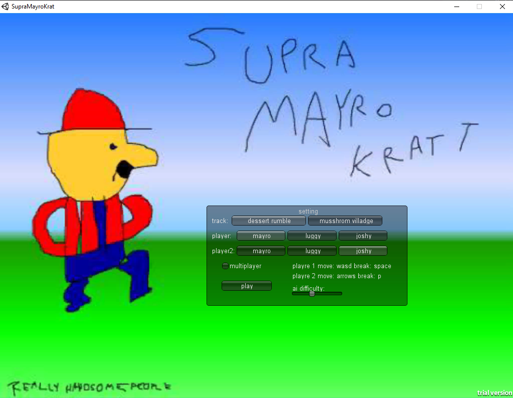

> Cover image done by yours truly

So, if you've been attention to the small 3 sentences bio on the left, you might have noticed the "World record holder". That's a line I like to use for comedic purposes.
The question now is : "What game did I speedrun ?" The answer to that is of course...

# Supra Mayro Kratt
A silly game made by olo76 on Itch.io (link below if you want to try the game). Like many, my first contact was with [Vinesauce's video on it](https://youtu.be/FxYKu_lkY_4), back in 2012. The game is obviously a ripoff from Mario Kart, but with the particularity that it is SO repugnant, the code decides to not work like intended 90% of the time (I'll come back to that).

The game is pretty straight forward. Two tracks and three character. Who could forget the lovable trio : Mayro, Luggy and Joshy ?

Okay, the main menu looks... not graphically outstanding, but surely the _driving_ in this _karting_ game is fun ?

It's not. Here is a (non-exhaustive) list of irritating details about the gameplay :
- Randomly, the car may jump 5m into the air and spin uncontrollably, for NO reason
- Walls in the desert map are annoying to deal with, because they make you spin out _sometimes_. You may also bump into them if stars align, which is a surprise tool that will help us later
- The break button **STOPS** all momentum, even mid-air. You can thus spin at your heart content while slowly falling, if that's your... _drift_
- Falling into the void doesn't reset your momentum tho, which is used to skip the entire mushroom circuit. It also always put you at the very start of the race, so if you accidentaly fell off the map at the last turn, you just lost an entire _lappe_ (as the game calls them)
- I could go on...

Design : Big ❌

Gameplay : Somehow bigger ❌

So maybe the music is tolerable ? YES ! The OST is straight up bussin' fr fr no cap. In fact, you should be able to hear the main theme in just a moment. The guitar tab is pretty nicely played. I urge you to listen to the whole OST after reading this blog post.

One thing that really caught my eyes while attempting the speedrun is the first problem of the fore mentioned list. I literally decompiled the code of this game (which mind you only takes a total of ~100 lines and some assets placed in a chaotic manner) and found no reason as to why driving straight sometimes makes you jump and spin around.

# The speedrun

Ah, the part you actually care about (hopefully). Here is the actual speedrun, I will discuss it a bit bellow.
<iframe width="100%" height="468" src="https://www.youtube.com/embed/scI1gt7AhW8" title="YouTube video player" frameborder="0" allowfullscreen></iframe>

Here, we'll see that special tool I was talking about. By using a precise angle we get with the mid-air break, and _precisely_, we can bounce using the wierd wall collisions to skip a considerable chunk of the map. 

:::note
Although you might think that this might go into the "Skip" section of the speedrun (in the speedrun.com leaderboard), "skipping" in this game is just hovering next to the finish line and winning. It's super easy and can be done under 10 seconds.
:::

Okay, well that's it for this post. The first one, it's pretty nice. Thanks for hopefully having read that and feel free to give me your remarks / questions / insults on my discord (if I added the link somewhere). Thanks again to Fuwari for allowing the use of their Astro template. Oh, I wrote this at like 3am, excuse my attitude. 

Have a nice day !